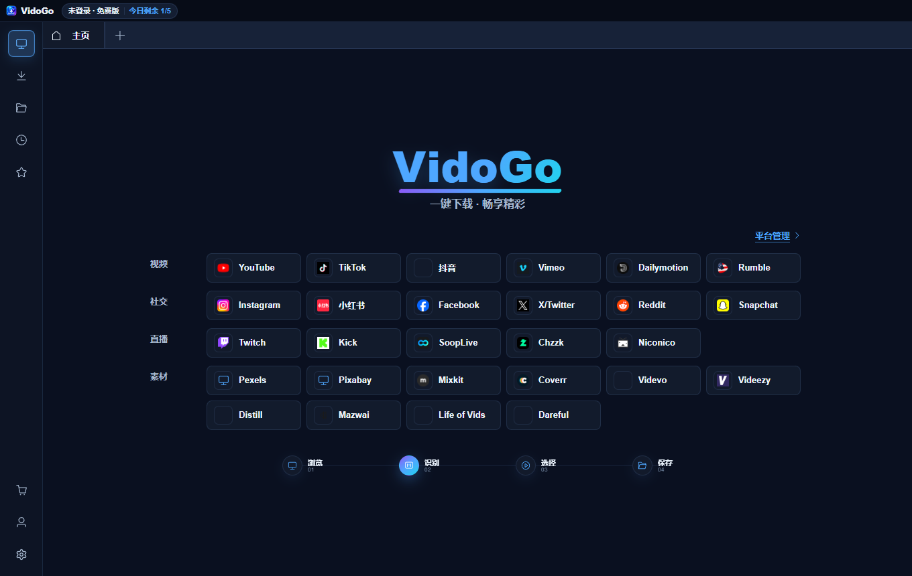
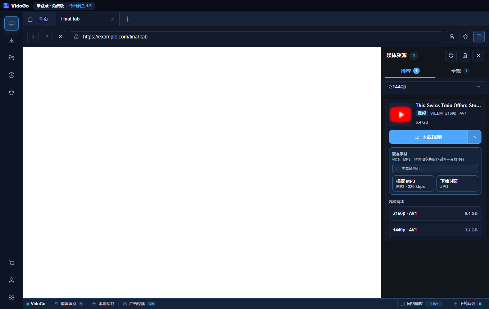
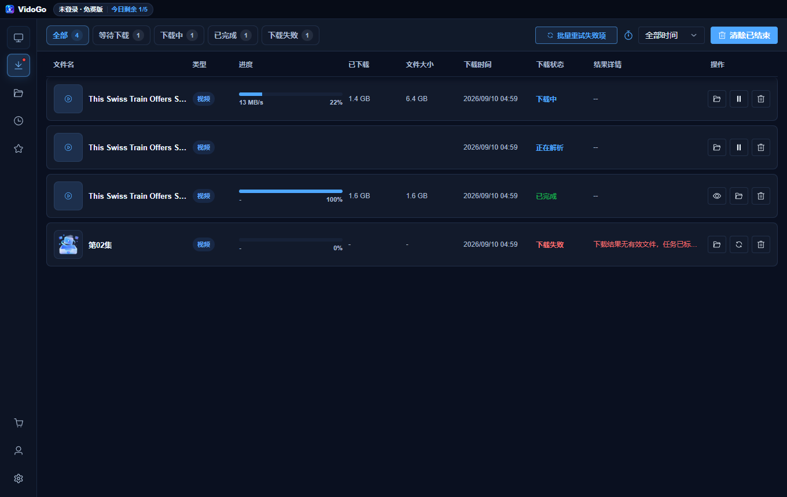
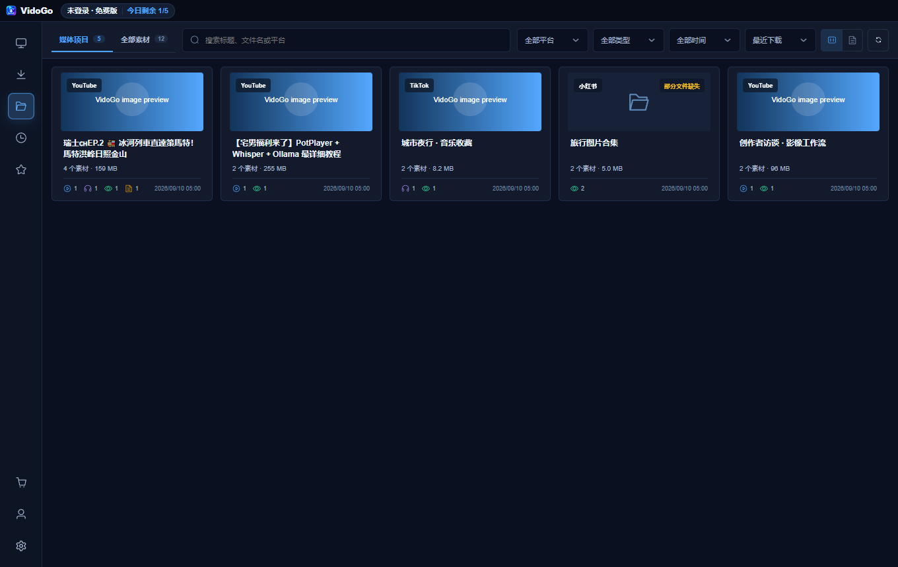
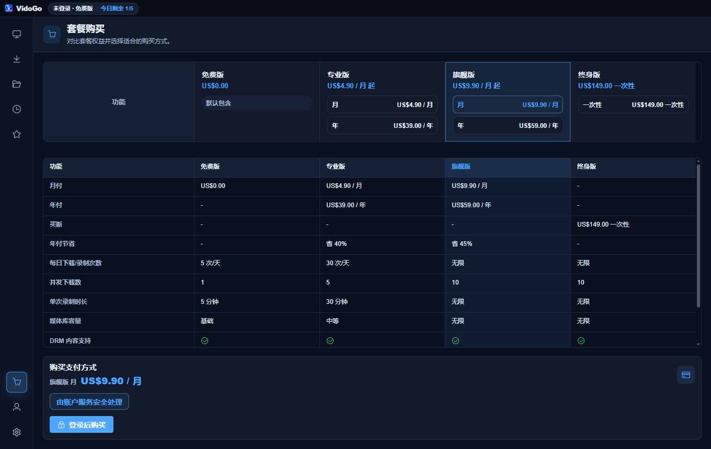
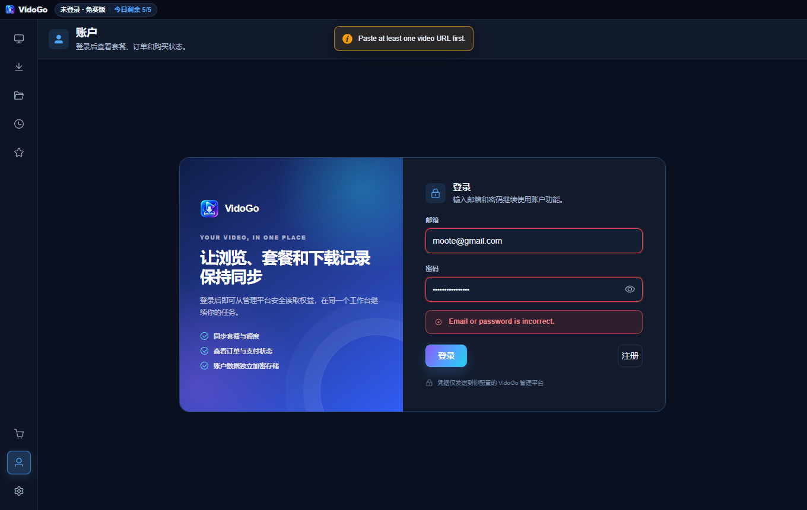

# VidoGo Basic 0.1.9 产品方向审查

日期：2026-09-10  
范围：尚未正式上线的 Windows 桌面端 0.1.9、现有 VidoGo 网页端（仅作未来品牌/获客一致性参考）、同类产品定价与 2026 年宏观/创作者经济背景。

## 一句话结论

这个品类有人付费，但用户不会因为“支持更多网站、更多协议、更多清晰度”自动选择 VidoGo。VidoGo 当前最有机会的方向不是继续做一个泛用下载器，而是聚焦为小型内容创作者、剪辑师和内容研究者提供“从公开视频到可剪辑素材包”的本地工作台。

当前版本已经具备这条方向所需的技术骨架：浏览器登录态、媒体识别、视频/MP3/封面/字幕归档、素材库和剪辑软件导入。问题主要出在定位、首次成功、可信度、定价和数据验证，而不是基础功能不够多。

对“有没有人会买单”的直接回答是：同类市场已经证明有人愿意为可靠、易用的视频获取工具付费；但目前没有证据证明用户会为 **VidoGo 当前这套定位和价格** 付费。最值得验证的付费假设是“高频创作者愿意为一次生成并整理可剪辑素材包而付费”，而不是“普通用户愿意订阅一个下载器”。

## 当前阶段判断

这个产品尚未正式上线、也没有真实付费用户，所以现在不能判断“留不住用户”，更不能用留存率或转化率评价产品。GitHub Release 只是开发/测试分发，不视为产品上线，也不作为需求证据。

准确的阶段判断是：VidoGo 已经做出了功能较完整的可验证产品，但“目标用户、核心使用场景、首次成功路径和付费理由”仍是假设。下一步不应继续凭感觉堆功能，而应先用少量目标用户完成封闭测试和真实预售，再决定是否正式上线。

## 2026 年市场背景

- 全球经济有韧性但增长仍偏弱。世界银行预计 2026 年全球增长约 2.6%；中国消费者仍较谨慎，世界银行预计中国 2026 年增长 4.4%。国家统计局数据显示，2026 年上半年中国社会消费品零售总额仅增长 1.3%，居民人均消费支出实际增长 2.7%。低价值、非刚需的软件订阅会更难卖。
- 创作者市场很大，但多数个人创作者收入并不稳定。CreatorIQ 2026 年对 5,095 名创作者的调查显示，67% 的创作者年内容收入低于 1 万美元，62% 并不以创作为主要收入来源。这类用户会为能直接省时间或增加产出的工具买单，但会强烈比较价格。
- AI 并不是必须添加的卖点。该调查中 72% 的创作者用过 AI，但只有 1% 用 AI 做工作流自动化。VidoGo 更好的机会是可靠的素材工作流，而不是再加一个泛化 AI 功能。
- 视频下载本身已有成熟付费市场。4K Video Downloader Plus 宣称拥有 6,200 万以上用户，当前个人版约 15 美元/年或 25 美元买断，专业版约 42 美元买断；Video DownloadHelper 的终身授权约 39 美元。与此同时，yt-dlp 和多个图形界面产品完全免费。用户付费购买的是省事、可靠、批量、登录态和持续适配，不是底层下载能力。

## 谁可能买单

### 最值得服务：高频小型创作者和剪辑师

典型用户每周制作 3 条以上内容，需要从 YouTube、TikTok/抖音、Instagram/小红书等来源整理自己拥有授权、可合法复用或用于研究的素材。他们真正需要的是：

1. 一次获得视频、音频、字幕、封面和来源信息；
2. 自动放进一个清楚的项目目录；
3. 直接预览并送进剪映、CapCut、Premiere 或 DaVinci Resolve；
4. 下次还能搜索、复用和知道素材来自哪里。

这正是 VidoGo 当前“配套素材 + 素材库 + 编辑器导入”组合最有差异化的地方。

### 可以作为免费获客：偶尔下载的普通用户

这个群体数量大，但付费意愿低、搜索竞争强，并且免费网页和开源工具非常多。应让网页端和 Basic 免费版满足轻量需求，再把有批量、登录态、素材管理或剪辑需求的人引向桌面版。

### 暂时不要主攻：DRM 流媒体下载用户

这条线客单价可能高，但技术维护、法律、支付和平台封禁风险也最高。当前实现明确拒绝已确认的 DRM 媒体，套餐表却把“DRM 内容支持”在所有方案中显示为支持，必须立即修正。不要用尚未交付的高风险能力支撑高价套餐。

## 为什么当前版本难留人

### 1. 首页展示了能力，却没有给出一个强起点

首页首屏是 27 个网站入口和“浏览 → 识别 → 选择 → 保存”的抽象流程。用户没有看到醒目的“粘贴链接”输入框、示例链接、预计结果或推荐动作。对第一次使用者来说，要先猜“点网站后播放视频，再看右侧面板”。

建议把首页主任务改为：

> 粘贴公开视频链接，一次生成可剪辑素材包  
> 视频 + MP3 + 字幕 + 封面 + 来源信息

主按钮只保留一个：“分析并生成素材包”。网站快捷入口降为次要入口。支持从剪贴板自动识别链接，但应明确提示并让用户确认。

### 2. 核心价值被技术术语掩盖

媒体面板首先呈现 WEBM、AV1、分辨率和 GB 大小，这对技术用户有用，却不是普通创作者的决策语言。默认项应直接解释结果，例如：

- 推荐剪辑：MP4 / H.264 / 1080p，兼容剪映和 Premiere；
- 最高画质：2160p / AV1，文件较大，部分编辑器需转码；
- 完整素材包：视频 + MP3 + 封面 + 中文字幕。

高级编码信息可以折叠显示。

### 3. “完成下载”不是用户任务的终点

下载页现在像任务监控器，素材库像文件浏览器，但两者没有形成明显的下一步。每次成功后应该给出唯一而清晰的继续动作：“打开素材包”“导入剪映/CapCut/Premiere”“复制来源署名”。这才会把一次性下载变成重复工作流。

### 4. 免费额度在惩罚差异化功能

免费版每天 5 个下载/录制任务，而视频、MP3、封面、字幕分别按任务计数。一次完整素材包可能消耗 3 至 4 次额度。用户刚体验到 VidoGo 的独特价值就接近用完免费额度，容易把限制理解为人为制造麻烦。

应按“来源项目”计费或计额：同一 URL 生成的整套素材只算 1 个项目。免费版可以限制每天 3 至 5 个项目，付费版提供无限项目和批量自动化。

### 5. 价格与当前定位不匹配

当前有免费、专业、旗舰、终身四档，价格最高到 9.90 美元/月和 149 美元买断。若用户把它理解为下载器，终身价约为成熟竞品的 3 至 6 倍；若把它理解为创作者工作台，页面又没有证明它为创作节省了多少时间。

建议在验证期只保留两档：

- Free：每天 3 至 5 个来源项目，单项目可生成完整素材包；不强制注册。
- Creator：29 至 39 美元/年，或创始用户 49 至 69 美元买断；包含无限项目、批量/播放列表、保存预设、编辑器导入、优先站点修复。

达到稳定留存并验证团队需求后，再增加 Studio 档。暂不提供 149 美元终身版；持续适配平台需要长期维护成本，永久无限更新并不是健康的早期承诺。

### 6. 信任门槛会阻止安装

0.1.9 安装包约 227 MB，且 Windows Authenticode 状态为 `NotSigned`。陌生的视频下载工具本来就属于高警惕品类，未签名安装包会显著放大安全疑虑。

产品化发布前至少需要：

- 代码签名或明确的签名计划；
- 官网提供桌面版真实截图、30 秒演示、SHA-256、VirusTotal 检测和隐私说明；
- README 提供安装后的三步使用说明，而不只是源码运行方式；
- 明确“只处理你拥有权利、获得许可、Creative Commons 或平台允许下载的内容”。

### 7. 官网与桌面版互相抢定位

官网强调“无需安装、无需登录、免费核心工具”，FAQ 也写明不需要应用或扩展；桌面版却包含账户、套餐和高级工作流。网页端没有清楚解释为什么需要桌面版，`Go Pro` 也没有形成有说服力的桌面转化路径。

建议明确产品架构：

- VidoGo Web：公开链接的免费轻量下载，用于 SEO 和首次体验；
- VidoGo Creator for Windows：登录态、批量、完整素材包、素材库、剪辑软件导入；
- 官网在用户第一次成功后再提示桌面版，而不是一进站就要求安装。

### 8. 没有数据就无法改留存

当前桌面端代码中没有发现产品分析或留存事件。应使用隐私友好的事件，只记录动作和结果，不记录完整 URL、下载内容或账户凭据。

最小事件集：

`first_open` → `source_opened` → `media_detected` → `asset_pack_started` → `verified_saved` → `editor_imported` → `second_session` → `paywall_viewed` → `checkout_started` → `purchase_completed`

失败事件至少记录平台、阶段和归一化错误类型。核心指标不是安装量，而是：

- 首次成功率：首次打开后是否成功保存至少一个有效文件；
- 首次成功时间：目标中位数小于 3 分钟；
- 激活后 7 日复用率：完成首次成功的人是否再次处理新来源；
- 素材包采用率和编辑器导入率；
- 每个平台的识别/下载成功率；
- 付费页到结账、结账到支付的转化。

## 上线前 30 天验证计划

### 第 1 周：修正承诺和首次使用

1. 删除错误的 DRM 支持承诺。
2. 首页增加粘贴链接主入口和示例任务。
3. 把“完整素材包”作为默认推荐动作。
4. 统一中文界面中的错误消息；当前账户流程会出现英文错误。
5. 把免费额度改为按来源项目计算。

### 第 2 周：建立信任和数据

1. 为安装包增加签名或可信发布说明。
2. 官网增加桌面版差异化页面、实际截图和 30 秒演示。
3. 增加隐私友好的激活、成功、失败和复用事件。
4. 在应用内增加“报告当前链接问题”，自动附带脱敏的平台和错误阶段。

### 第 3 周：只找目标用户验证

招募 10 至 15 位每周制作 3 条以上内容的剪辑师/创作者。让他们用自己的合法素材完成任务，观察而不是讲解。访谈重点：

- 第一次在哪里犹豫；
- 他们当前如何收集视频、音频、字幕和封面；
- 哪一步最耗时间；
- 下载完成后下一步是什么；
- 是否愿意当场支付 29 至 39 美元/年或购买创始授权。

不要把“觉得不错”当验证，以 5 位真实付费创始用户为第一道门槛。

### 第 4 周：根据行为决定继续或收缩

继续投入的最低信号：多数测试用户不经帮助能在 3 分钟内成功；至少一半主动使用完整素材包；有人在一周内带着新链接回来；至少 5 位目标用户真实付费。

如果用户只把它当偶尔使用的下载器，则停止扩张桌面功能，把 Basic 定位为免费获客工具，并将付费研发转向素材包、编辑器导入和项目资产管理。

## 产品流程审查

### Step 1：首次打开首页 — 健康度：偏弱

优点：视觉整洁、支持站点丰富、账户额度可见。  
问题：没有主输入和首个任务，站点矩阵抢占注意力；“一键下载”与实际多步流程不一致；左侧纯图标导航对新用户不够可发现。

### Step 2：检测媒体并选择下载 — 健康度：中等

优点：识别结果、大小、分辨率和相关素材集中在同一处，主下载按钮明确。  
问题：默认决策仍以编码和分辨率为中心；页面与右侧工具面板割裂；缺少面向剪辑结果的推荐项和风险提示。

### Step 3：查看下载任务 — 健康度：中等偏好

优点：解析、下载、完成、失败状态清楚，暂停、重试和打开目录都存在。  
问题：信息密度高，文件名截断严重；失败后的恢复建议不够任务化；完成行没有突出“打开素材包/导入编辑器”的下一步。

### Step 4：管理素材库 — 健康度：方向正确、价值表达偏弱

优点：按来源聚合视频、音频、图片和字幕，是最可能形成长期留存的页面。  
问题：卡片第一眼仍像普通文件库；没有展示“已节省时间、来源许可/署名、可继续剪辑”等持续价值；占据大量空白却没有引导下一任务。

### Step 5：比较套餐 — 健康度：高风险

优点：价格和基本额度可比较。  
问题：四档过早、表格过重、卖点主要是限制解除；所有方案错误宣称 DRM 支持；149 美元终身价与下载器心智不匹配；没有成果、案例或节省时间证明。

### Step 6：登录/注册 — 健康度：中等偏弱

优点：表单层级清楚，密码输入和错误区域具有基础语义。  
问题：中文界面出现英文错误；登录页主文案强调“同步套餐和订单”，没有说明它如何帮助用户完成工作；在品牌信任尚未建立时，账户和凭据会成为额外阻力。

## 可访问性观察与限制

代码中已为大多数图标按钮提供 `aria-label`，对话框和进度条也有基础语义，这是优点。截图可见风险主要是大量 11–12px 左右的辅助文字、低对比度蓝灰文本、纯图标侧栏和信息密集表格。键盘顺序、焦点可见性、屏幕阅读器朗读、缩放和不同 DPI 下的重排不能仅凭截图确认，需要单独测试。

## 最高优先级决策

如果只能做一件事，不要再扩站点数量。把首页改成“粘贴一个链接 → 一键生成可剪辑素材包 → 直接导入剪辑软件”，用 10 至 15 位真实高频创作者验证。这个闭环如果能产生复用和付费，VidoGo 才从一个功能丰富的下载器变成产品。

## 参考来源

- [VidoGo 官网](https://vidogo.cc/)
- [VidoGo 服务条款](https://vidogo.cc/terms)
- [GitHub 仓库 API](https://api.github.com/repos/Imoot-TT/VidoGo-Basic)
- [GitHub Releases API](https://api.github.com/repos/Imoot-TT/VidoGo-Basic/releases?per_page=20)
- [世界银行 2026 年全球经济展望](https://www.worldbank.org/en/news/press-release/2026/01/13/global-economic-prospects-january-2026-press-release)
- [世界银行 2026 年中国经济更新](https://www.worldbank.org/en/news/press-release/2026/07/07/rebalancing-growth-china-economic-update)
- [国家统计局：2026 年上半年居民收入和消费支出](https://www.stats.gov.cn/sj/zxfbhjd/202607/t20260715_1964129.html)
- [国家统计局：2026 年上半年社会消费品零售总额](https://www.stats.gov.cn/sj/zxfb/202607/t20260715_1964127.html)
- [CreatorIQ State of Creators 2026](https://www.creatoriq.com/press/releases/creatoriq-state-of-creators-report-2026)
- [4K Video Downloader Plus](https://www.4kdownload.com/products/videodownloader)
- [Video DownloadHelper Premium](https://api.downloadhelper.net/premium)
- [yt-dlp 官方 GitHub](https://github.com/yt-dlp/yt-dlp)
- [YouTube：版权许可类型](https://support.google.com/youtube/answer/2797468)
